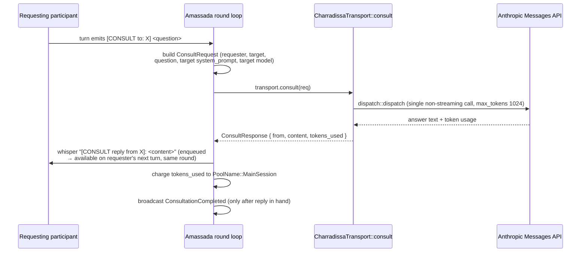

# Occitan Stack — [CONSULT] Cross-Component Consultation Protocol

## What this document is

This is the canonical reference for the `[CONSULT]` protocol — the mechanism by which an
Amassada deliberation participant obtains a synchronous, same-round answer from another
agent identity (a persona or component agent) when it needs a capability outside its own
scope.

`[CONSULT]` was wired live on 2026-07-04:

- **Amassada** `f77e8aea` — wires the `[CONSULT to: …]` block to real dispatch with
  same-round reply delivery (`crates/amassada-core/src/round.rs`).
- **Charradissa** `54417747` — `CharradissaTransport::consult` implements the
  `amassada_core::channels::consult` contract on the routing side
  (`charradissa-core/src/transport.rs`).

This closes the prior stub tracked as **Charradissa #41** (`CharradissaTransport::consult()`
stub — CONSULT path incomplete).

This is a protocol document, not an agent definition: it describes a bilateral contract
between two components (emitter and router), not a single agent's behaviour. See
[Placement](#why-this-is-a-protocol-document-not-a-discipline) for why it lives here rather
than as a composable discipline.

---

## When to use it

A participant in an Amassada session issues a `[CONSULT]` when the current turn requires a
capability, fact, or judgement that is outside its own persona's scope, and it needs the
answer *within the current round* to proceed — not a full multi-turn handoff. Typical case:
a deliberation needs, say, Matrix-protocol expertise that no seated participant holds, so a
participant consults an agent identity that does.

`[CONSULT]` is **not** the mechanism for:

- Multi-turn delegation of a sub-task. The consulted agent answers exactly once and cannot
  itself consult (no recursion — see [Constraints](#guarantees-and-constraints)).
- Work tasking between components. Work handoff flows through Guilhem via Nervi
  (`occitan.dispatch.<component>`), never through `[CONSULT]`.
- Anything that must survive the session. `[CONSULT]` produces a whisper into the round; it
  is not persisted as an independent artifact.

---

## The block

A participant emits, on its own turn, a block whose header is `[CONSULT to: <agent>]`
followed by the question as the block body (the body runs until the next block header):

```
[CONSULT to: charradissa]
Does the appservice transaction endpoint require an empty-object ack, or is a 200 with
any body sufficient?
```

- `<agent>` resolves against the seated session participants by `agent_id` **or** `persona`
  (`round.rs`). If no participant matches, the target's system prompt defaults to
  `"You are a <agent> agent."` and a warning is logged — the consultation still dispatches.
- The block is parsed in `amassada-core/src/blocks.rs` as `AgentBlock::Consult { to, content }`.
  It is a participant block, available to any participant — it is distinct from the
  moderator-only `[FORK_CONSULTATION: <a>, <b>, <topic>]` sidebar block.

---

## How it flows



### Emitter side (Amassada, `round.rs`)

1. For each `[CONSULT to: X]` block in a parsed turn, the round loop builds a
   `ConsultRequest` carrying the requester, the target `AgentId`, the question, and the
   **target's** `system_prompt` and `model` (assembled from the target participant's persona
   and domain — so the transport dispatches without reaching back into session state).
2. It calls `self.transport.consult(&req).await`.
3. On success it whispers `[CONSULT reply from X]: <content>` back to the requester and
   enqueues it on the whisper queue, so it lands on the requester's **next turn in the same
   round**. It then charges `tokens_used` against `PoolName::MainSession` and broadcasts
   `SessionEvent::ConsultationCompleted` — which fires *only after* the answer is in hand.
4. On error it whispers `[CONSULT failed — X unavailable]` to the requester so the round is
   never silently blocked (see [failure](#guarantees-and-constraints)).

### Router side (Charradissa, `transport.rs`)

`CharradissaTransport::consult` dispatches a **single, synchronous, non-streaming Anthropic
Messages API call** (`amassada_core::dispatch::dispatch`, `max_tokens: 1024`) using the
target's `system_prompt` as the system prompt and the question as the user turn. It returns
`ConsultResponse { from, content, tokens_used }`, where `tokens_used = input + output`.

---

## Relationship to Matrix, Nervi, and HTTP

This is the question Fondament readers most need answered, and the wired answer is specific:

**`[CONSULT]` uses neither Matrix nor Nervi.** The deployed `CharradissaTransport::consult`
performs a direct HTTP dispatch to the Anthropic Messages API for the target agent's
persona and returns the reply in-process. There is no Matrix room round-trip and no
`nervi_publish`/`nervi_subscribe` on the consultation path.

This is deliberate and follows from the protocol's defining guarantee — **same-round reply**.
Nervi's pub/sub fabric is asynchronous by design (its whole model is subscribe-and-drain,
not request-and-await); routing a consultation through it could not guarantee an answer
before the requester's next turn. A direct dispatch can. Nervi remains the channel for
*work tasking* and *asynchronous contributions* between components
(`occitan.dispatch.*`, `occitan.contribution.*`); `[CONSULT]` is the channel for a
*synchronous in-round question*. The two are complementary, not alternatives.

> Note for maintainers: earlier design framing described `[CONSULT]` as "triggering Nervi
> dispatch internally." The wired implementation (Charradissa `54417747`) does not — it
> dispatches directly. This document reflects the code as shipped. If a future revision
> moves consultation onto Nervi, it must first solve the same-round latency guarantee, and
> this section must be updated in lockstep.

---

## Guarantees and constraints

- **Same-round delivery.** The reply is whispered back and enqueued so it is available on
  the requester's next turn within the same round. This is the protocol's contract.
- **Single-shot, no recursion.** The `Transport::consult` trait contract states the target
  MUST NOT initiate further consultation turns — there are no recursive `[CONSULT]` calls.
  The consulted agent answers exactly once.
- **Bounded output.** The router caps the consultation reply at `max_tokens: 1024`.
- **Budgeted.** Consultation token cost (`input + output`) is charged to
  `PoolName::MainSession`. If the session budget is exhausted the charge fails with a logged
  warning; the reply is still delivered.
- **Failure is non-blocking.** If `consult()` errors (target unavailable, dispatch failure),
  the requester receives a `[CONSULT failed — X unavailable]` whisper instead of the answer.
  The round proceeds; the requester is never silently stalled.
- **Not persisted.** A consultation produces a whisper into the live round and a
  `ConsultationCompleted` event. It is not written to Farga as a standalone artifact
  (consistent with system-defence A-6: load-bearing decisions are persisted through the
  session's own Farga write, not the consultation channel).

---

## Why this is a protocol document, not a discipline

`[CONSULT]` was considered for three placements in Fondament; this file records why the
protocol-document form was chosen.

1. **Not a discipline.** A discipline is a horizontal knowledge domain composed into a
   *single* agent's assembled context. `[CONSULT]` is a *bilateral* contract — one side
   emits (Amassada's round loop), the other routes (Charradissa's transport). A discipline
   composed into one agent cannot express both sides of a contract.
2. **Not a modifier discipline.** Modifier disciplines (e.g. `aporia`) change how the
   Fondament resolver *assembles the prompt*. `[CONSULT]` has no resolver-side effect at
   all — its entire behaviour lives at Amassada/Charradissa runtime. Modelling it as a
   modifier would be a category error.
3. **A protocol document.** `system-defence.md` sets the precedent: a cross-cutting
   contract that lives under `definitions/fondament/` as authoritative Markdown rather than
   a composable primitive. `[CONSULT]` has exactly that shape, and the driving need — a
   canonical reference for future implementers of consultation support in other components —
   is served by one authoritative spec, not by fragments duplicated across agent contexts.

The two owning component agents (`amassada-agent`, `charradissa-agent`) carry a short
pointer to this document rather than a copy of the contract, keeping the specification
single-sourced.
